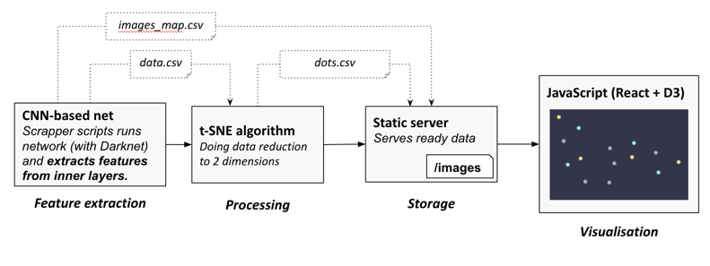
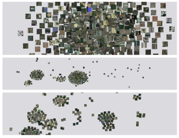
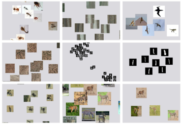

# TSNE visualisation tool for clustering images based on data from intermediate layers from CNN.

##Full system architecture

This projects contains all but feature extraction components.

`tsne-backend` - applying tsne algorithm to the input data

`static server` - stores intermadiate data

`frontend` - visual tool for discovery of the results 

## Clusterization result samples

Results based on the output of ResNet and Yolo CNN networks.

